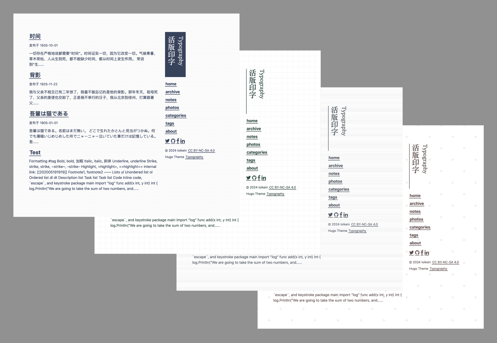

# hugo-theme-typography



**WIP**

Upstream: 

- [sumimakito/hexo-theme-typography: Rediscover the beauty of typography.](https://github.com/sumimakito/hexo-theme-typography)
- [lpgph/hugo-theme-typography: hugo theme](https://github.com/lpgph/hugo-theme-typography) \(Demo: [诗和远方](https://lpgph.github.io/)\)
- [loikein/hugo-typography](https://github.com/loikein/hugo-typography) \(private repo\)

## Fork notes

主要是为了让它长得更像原来的 Hexo 主题。本来想自己重新写一遍，写到一半实在懒得了。

- [x] 移除了 Live2D-Widget，APlayer，以及其余的（我觉得）不是很合适这个主题的部件
- [x] 新增了 example site（不完整，比如没有照片）
- [x] 新增了一大堆可更换的颜色主题，亮暗都有
- [x] Valine 已经停止更新，换到 [Waline](https://waline.js.org/en/migration/valine.html)（但其实我也不用，没法测试）
- [x] 新增了 Mobile footer
- [x] 新增了文章列表和文章内的翻页样式
- [x] 修改了 TOC 的样式
- [x] Pin posts to top (set `weight=-1` in front matter)
- [x] Taxonomy page
- [x] Implement `==highlight text==` syntax (thanks: [bowman2001/hugo-mod-replacements](https://github.com/bowman2001/hugo-mod-replacements/tree/main))
- [x] Section page with content
- [x] Code block style
    - [ ] Use classes
- [x] Internal link validation
- [x] Support [Critic Markup](https://fletcher.github.io/MultiMarkdown-6/syntax/critic.html)
- [x] Sticky-like side note
- [x] Poem block
- [ ] Refresh 404 page
- [ ] Styles for `<table>`
- [ ] (?) External link validation
- [ ] (?) Taxonomy <u>terms</u> page CSS
- [ ] menu config
- [ ] (?) Light/dark mode switcher

## Features

- Comment systems \(not tested\)
    - Disqus
    - Gitalk
    - Waline
- Site-wide search with Pagefind
    - Extra configurations are needed in order to use this feature. See [Pagefind | loikein's wiki](https://wiki.loikein.one/programming/web/static-site/pagefind/) for more details.
    - Setting `[params] search=false` to turn off search completely.

## Config

### `hugo.toml`

#### Basis

Ref: [Site methods | Hugo](https://gohugo.io/methods/site/)

- `baseURL`: `https://example.com`
- `theme`: `hugo-theme-typography` \(this theme is not Hugo Module ready\)
- `title`: Title of your website
- `copyright`: Can use Markdown

.

Ref: [Multilingual mode | Hugo](https://gohugo.io/content-management/multilingual/#changes-in-hugo-01120)

- `hasCJKLanguage`: Improves word count for CJK languages
- `defaultContentLanguage`: Must be one of the language codes in `languages.lang`
- `languages.lang`
    - `lang`: Enter the primary subtag of the [RFC 5646 tag](https://developer.mozilla.org/en-US/docs/Web/HTML/Global_attributes/lang) for your contents, NO subsequent sub-tags
    - `languageCode`: Enter the [RFC 5646 tag](https://developer.mozilla.org/en-US/docs/Web/HTML/Global_attributes/lang) for your contents, including any subsequent sub-tags

.

- `mainSections`: List of folders under `/content/` to be considered as main sections.
- `paginate`: Number of items per page in paginated lists
- `enableEmoji`: `true` to use [emoji shortcuts](https://gohugo.io/quick-reference/emojis/)
- `enableRobotsTXT`: Generates an [allow-all robots.txt](https://gohugo.io/templates/robots/)
- `enableGitInfo`: Use git commit info to generate lastmod info

#### `[Params]`

Ref: [Params | Hugo](https://gohugo.io/methods/site/params/)

**TBE**

- `search`: `true` to activate the Pagefind search page.
- `NoIndex`: `true` to prevent showing up in Google SERP (site-wide)
    - DO NOT set `enableRobotsTXT` if you want to use this option

### Custom CSS

In your own website repo, create `./assets/scss/_custom.scss`, and put your code there.

Example 1: Change symbol (dinkus) \& style of `<hr>`

```scss
.post-content hr::after {
  content: "∗ ∗ ∗";
  text-shadow: 0 0 .75px $global-font-color;
}
```

Example 2: Adjust where to break line for site subtitle

```scss
.header-container .site-title h3 {
  max-inline-size: 11em;
}
```

Example 3: Change over-scroll behaviour

```scss
html,
.main-container {
  overscroll-behavior-y: none;
}
```

### Custom HTML head

In your own website repo, create `./layouts/partials/body_head_custom.html`, and put your code there.

Example: links to favicon assets \(using files generated by [favicon.io](https://favicon.io/)\)

```html
<link rel="apple-touch-icon" sizes="180x180" href="/apple-touch-icon.png">
<link rel="icon" type="image/png" sizes="32x32" href="/favicon-32x32.png">
<link rel="icon" type="image/png" sizes="16x16" href="/favicon-16x16.png">
<link rel="manifest" href="/site.webmanifest">
```
